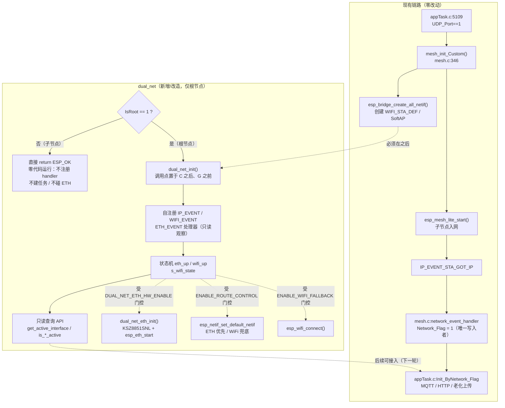

## 产品概述
在现有电池老化测试网关固件（ESP32-S3 / ESP-IDF v5.4.4 / ESP-Mesh-Lite + IoT-Bridge）中，把已存在但**未参与编译**的 `dual_net` 模块改造为 Mesh-Lite 兼容版本并正式接入，使其具备「WiFi STA 上行 + 有线以太网」双网通信能力，同时为后续网线接入预留完整扩展点。核心前提是**子节点成功连接根节点的现有链路必须完全不受影响**。

**最重要的范围约束：dual_net 只服务于根节点（含单机根节点）。所有执行路径仅在 `IsRoot == 1` 时触发；子节点（含纯 mesh 子节点）上 dual_net 完全不初始化——不注册事件处理器、不创建监控任务、不触碰 ETH、不写 `Network_Flag`，运行期开销为 0。** 这与历史实现一致（commit `7ee654a` 中为 `if (mesh_layer == 1 && !s_dual_net_inited)` 才注册 dual_net 回调）。

## 已识别：子节点成功连接根节点的现有实现（本轮零改动保护区）
- 网络总开关：`appTask.c:5109` `if (UDP_Port == 1)` → `mesh_init_Custom()`
- 子节点入网配置：`mesh.c:422-423` `join_mesh_ignore_router_status=true`、`join_mesh_without_configured_wifi = !IsRoot`
- 层级约束：`mesh.c:443` `esp_mesh_lite_set_disallowed_level(1)`（子节点禁止成为第 1 层）
- 父节点 SSID 反解：`mesh.c:264-279` `lg_mesh_get_ssid_by_mac()`，注册于 `mesh.c:451`
- **成功判定点**：`mesh.c:116-133` `network_event_handler()` 收到 `IP_EVENT_STA_GOT_IP` → `Network_Flag = 1`
- 断链判定点：`mesh.c:134-139` `IP_EVENT_STA_LOST_IP` / `WIFI_EVENT_STA_DISCONNECTED` → `Network_Flag = 0`
- 业务消费方：`appTask.c:2977` `Init_ByNetwork_Flag()` 轮询 `Network_Flag==1` → MQTT 初始化/启动 → （子节点）HTTP + 老化上传 + 掉电恢复
- 任务编排：`appTask.c:5119-5145`

**`Network_Flag` 的两种语义（两者都仍由 `mesh.c:network_event_handler` 独占写入，dual_net 不参与）：**
- 根节点：STA 连上外部路由器取得 IP → 1
- 子节点：经 mesh 从根节点 SoftAP 通过 NAPT 取得网段 IP → 1

## 核心特性
1. **dual_net 模块接入编译，且仅根节点启用**：剔除 `esp_mesh.h` / `esp_mesh_post_toDS_state()` 等 ESP-WIFI-MESH 遗留依赖，加入 `main/CMakeLists.txt`，并新增**唯一**初始化调用点（位于 `mesh_init_Custom()` 成功之后、`Init_ByNetwork_Flag` 任务创建之前），调用点以 `IsRoot == 1` 为前置条件。
2. **与子节点连接逻辑解耦**：`Network_Flag` 保持单一写入者（`mesh.c:network_event_handler`）；dual_net 在根节点上也默认只观察、不写入、不主动 `esp_wifi_connect()`、不 `esp_netif_set_default_netif()`，默认配置下现网行为逐字节不变；子节点侧 dual_net 根本不运行。
3. **以太网优先 / WiFi 兜底切换策略**：按 L0 观察 / L1 硬件启用并切路由 / L2 并行（预留）三级能力门控；说明不做并行的原因（lwIP 默认路由不确定 + IoT-Bridge NAPT 仅面向单一 external netif，双上行会导致回程错乱与 MQTT 抖动）。
4. **配置项**：编译期能力宏（总开关、根节点专属开关、ETH 硬件开关、路由控制开关、WiFi 兜底开关）、ETH 引脚宏（`ETH_CS` 补齐）、运行期 `baseconfig.json` 新增 `EthEnable`/`EthPrio` 字段与解析。
5. **有线接入兼容设计**：ETH 作为上行走 IoT-Bridge external netif（`esp_bridge_create_eth_netif()` + `esp_bridge_netif_list_add()`）而非自造 netif；补齐 `ETHERNET_EVENT`/`IP_EVENT_ETH_*` 与 Mesh-Lite `ESP_MESH_LITE_EVENT_CORE_INHERITED_NET_SEGMENT_CHANGED` 的事件映射；预留上行选择/通知 API 与硬件改造清单。

## 技术栈
沿用现有工程栈，不引入新依赖：ESP-IDF v5.4.4（独立副本 `/home/wbb/espidf/esp-idf-mesh-lite`）、ESP32-S3 双核 FreeRTOS、`espressif/mesh_lite 1.0.2` + `espressif/iot_bridge 1.0.1`、C（c99）、cJSON、`esp_netif` / `esp_eth` / `esp_event`。

构建命令（必须）：`IDF_SKIP_CHECK_SUBMODULES=1 idf.py -B build/mesh-lite -D SDKCONFIG=build/mesh-lite/sdkconfig build`

## 实现方案

### 总体策略
把 `dual_net` 改造成一个**仅根节点启用、默认只观察、可分级开启**的独立网络状态模块：

- **默认（L0）+ 根节点**：只采集并上报 ETH/WiFi 状态、绝不触碰路由与 `Network_Flag`。
- **默认（L0）+ 子节点**：`dual_net_init()` 在入口即返回 `ESP_OK`，一行业务逻辑都不执行。
- **打开开关后（L1）+ 根节点**：才初始化 KSZ8851SNL 硬件并执行以太网优先、WiFi 兜底的默认路由切换。

这样在当前默认配置下，`dual_net` 对 mesh 子节点入网链路的影响为 **0**（子节点根本不进入模块）。

### 关键技术决策与权衡
- **决策 1：`Network_Flag` 保持单一写入者。** 原 `dual_net_notify_network_state()` 会写 `Network_Flag` 并调用 `esp_mesh_post_toDS_state()`，这是最危险的双写点——它会与 `mesh.c:network_event_handler` 竞争同一全局量，且 legacy API 在 Mesh-Lite 构建下无法链接。方案：删除 `esp_mesh_post_toDS_state()` 全部调用与 `#include "esp_mesh.h"`；`Network_Flag` 写入改为受 `DUAL_NET_ENABLE_ROUTE_CONTROL` 保护，默认关闭。
- **决策 2：默认禁用 `dual_net_start_wifi()` 与 `dual_net_update_route()` 的副作用。** `esp_wifi_connect()` 会打断 Mesh-Lite 自组织的 STA/父节点管理；`esp_netif_set_default_netif()` 会破坏 IoT-Bridge 的 NAPT 转发链。两者在 L0 仅做状态判断与日志，实际动作由门控宏包裹。
- **决策 3：不实现并行双上行（L2 只预留）。** ESP32-S3 上 ETH 与 WiFi 同时承载上行会导致 lwIP 默认路由/源地址选择不确定；IoT-Bridge 的 NAPT 面向单一 external netif（当前 `CONFIG_BRIDGE_EXTERNAL_NETIF_ETHERNET` 未开，external 是 STA）。并行会让回程包错乱、MQTT 连接抖动。故本轮策略为「同一时刻只有一条上行」。
- **决策 4：ETH 走 IoT-Bridge external netif，不自造 netif。** 现有 `dual_net_eth_init()` 用 `esp_netif_new(ESP_NETIF_DEFAULT_ETH())`，绕过了 bridge 的 NAPT/DHCP 注册，子节点流量无法被正确转发。保留原函数但标记待替换，并预留 `esp_bridge_create_eth_netif()` 接入路径与 `CONFIG_BRIDGE_EXTERNAL_NETIF_ETHERNET` 开启说明。
- **决策 5：能力开关用头文件宏而非 Kconfig。** 降低 blast radius（不动 sdkconfig 生成流程）；后续若需菜单配置再迁到 `main/Kconfig.projbuild`。
- **决策 6：监控任务默认降频。** 现有 `dual_net_monitor_task` 每 10s 轮询并打印，L0 下无实际动作会造成日志刷屏；改为 L0 下 60s 周期、仅输出状态快照。
- **决策 7（本轮新增，范围约束）：dual_net 是「根节点专属模块」，采用双重门控。** `IsRoot` 在 `mesh.c:440-444` 已被静态固定（root→`set_allowed_level(1)`，node→`set_disallowed_level(1)`），不会运行时变化，因此入口判断一次即可。双重门控的理由：调用点判断是主防线，模块内判断是兜底（防止后续有人把调用点挪出 `if (IsRoot == 1)` 而静默污染子节点）。**明确不做**「子节点只读观察模式」——子节点的上行由 mesh 父节点通过 NAPT 提供，它没有独立上行，维护 `wifi_up` 等状态只会误导调用方；将来若子节点也要接网线，再新增 `DUAL_NET_ALLOW_NODE` 开关放开，本轮不留该开关。

### 性能与可靠性
- 事件处理器（`IP_EVENT`/`WIFI_EVENT` 的 `ESP_EVENT_ANY_ID`）与 `mesh.c` 中按具体 event_id 注册的 handler **共存于同一事件循环、互不屏蔽**；dual_net handler 内只做轻量状态赋值，不阻塞、不做 I/O、不调 MQTT/HTTP，避免在事件上下文引入重入风险。
- **子节点开销为 0**：不注册 handler、不建任务、不占 SPI2_HOST 总线与 GPIO、不增加启动时间与内存占用；只有根节点才承担 `LG_STACK_NET_MONITOR 3072` / `LG_PRIO_NET_MONITOR 3`（`task_config.h:67-68`）这一个绑 CPU1 的任务。
- 日志：沿用 `ESP_LOGI/W(TAG,...)`，中文；L0 下避免高频打印，状态快照 60s 一次；错误统一走 `storage_write_record_cyclic()`（与现有 dual_net.c 风格一致），禁止打印密码等敏感字段。
- **根节点 failover 交互（后续改造项，本轮不动）**：`mesh.c:185-249` `root_failover_task` 目前靠 `esp_restart()` 在 `SSID`/`SSID1` 之间切换主备路由器。L1 开启以太网后应改为「ETH 可用时不重启、直接优先 ETH」，本轮只在 `DUAL_NET_DESIGN.md` 记录该改造点，不触碰 `root_failover_task`。

## 执行要点（防回归）
- **根节点门控硬约束（本轮新增，最高优先级）**：`dual_net_init()` 只能在 `IsRoot == 1` 时被调用。调用点写成 `if (IsRoot == 1) { dual_net_init(); }`，且 `dual_net_init()` 内部开头再做一次 `if (IsRoot != 1) return ESP_OK;` 防御性判断。子节点路径上不允许出现任何 dual_net 符号执行。
- **初始化时序硬约束**：`dual_net_init()` 必须在 `esp_bridge_create_all_netif()`（`mesh.c:378`）之后调用，否则 `esp_netif_get_handle_from_ifkey("WIFI_STA_DEF")` 返回 NULL。故调用点只能放在 `appTask.c` 中 `mesh_err == ESP_OK` 分支内、创建 `Init_ByNetwork_Flag` 任务之前。
- **返回值修正**：现有 `dual_net_init()` 内 `ret` 初值为 `ESP_FAIL` 且被原样 return（第 646/715 行），即便 ETH 未启用也会返回失败。L0 下应返回 `ESP_OK`，避免调用方误判。
- **重复初始化保护**：保留并启用 `s_dual_net_initialized` 幂等标志。
- **零改动红线**：`mesh.c` / `mesh.h` 一行不改；`network_event_handler()`、`Init_ByNetwork_Flag()`、`app_task_init()` 现有分支逻辑一行不改，仅允许新增 `#include "dual_net.h"`、根节点分支内新增 `dual_net_init()` 调用、`load_baseconfig_json()` 内新增字段解析行。
- **遗留代码处置**：`dual_net_init()` 中已注释的 `dual_net_eth_init()`（第 652 行）与 `esp_eth_start()`（第 681 行）改为受 `DUAL_NET_ETH_HW_ENABLE` 条件编译包裹，而非删除，便于后续打开。
- **需复核的资源冲突**：SPI2_HOST 与 `SPI_MOSIPIN 15 / MISOPIN 7 / SCLK 6 / ETH_INT 4`、CS 硬编码 16 是否被现有外设（RS485/CAN/SPIFFS 等）占用——本轮不启用硬件也需先确认，避免将来打开开关时踩坑。

## 架构设计



**层次关系**：dual_net 是**观察层**，与 mesh.c 的**判定层**平行且只读；只有显式打开门控宏后，dual_net 才升级为**控制层**。`Network_Flag` 的写入权默认 100% 归 mesh.c。**作用范围**：dual_net 只对根节点生效，子节点完全不进入该模块。

**根节点 / 子节点职责对照表：**

| 维度 | 根节点（`IsRoot==1`） | 子节点（`IsRoot==0`） |
|---|---|---|
| dual_net 是否初始化 | 是 | **否，入口直接返回** |
| 事件处理器注册 | 是（IP/WIFI/ETH） | 无 |
| 监控任务 | 1 个（CPU1，60s 快照） | 无 |
| 上行来源 | 外部路由器 STA 或有线 ETH（本轮 ETH 预留） | mesh 父节点 → 根节点 SoftAP → NAPT |
| `Network_Flag` 写入者 | `mesh.c:network_event_handler` | `mesh.c:network_event_handler` |
| ETH 硬件 | 开关默认关闭 | 不初始化 |
| 主备路由器切换 | `root_failover_task`（`esp_restart`） | 不涉及，由 mesh 重新选父 |

## 目录结构

```
ESP32Aging/
├── main/
│   ├── CMakeLists.txt                                # [MODIFY] SRCS 增加 "Communication/Internet/dual_net/dual_net.c"；
│   │                                                 #          INCLUDE_DIRS 增加 "Communication/Internet/dual_net"
│   ├── Communication/Internet/dual_net/
│   │   ├── dual_net.h                                # [MODIFY] 定义能力门控宏（DUAL_NET_ENABLE / ROOT_ONLY /
│   │   │                                             #          ETH_HW_ENABLE / ENABLE_ROUTE_CONTROL / ENABLE_WIFI_FALLBACK）；
│   │   │                                             #          补齐 ETH_CS 引脚宏；新增上行枚举 dual_net_uplink_t 与预留 API 声明
│   │   │                                             #          （get_uplink_netif / select_uplink / register_uplink_change_cb）
│   │   └── dual_net.c                                # [MODIFY] 删除 #include "esp_mesh.h" 与全部 esp_mesh_post_toDS_state() 调用；
│   │   │                                             #          dual_net_init() 开头新增 IsRoot != 1 防御性返回（零代码运行）；
│   │   │                                             #          新增 dual_net_is_any_network_up 等只读 API；
│   │   │                                             #          dual_net_update_route / start_wifi 加门控；
│   │   │                                             #          修正 dual_net_init 返回值与幂等；监控任务 L0 降频；
│   │   │                                             #          eth_init 预留 esp_bridge_create_eth_netif 接入分支
│   ├── Task/
│   │   ├── appTask.c                                 # [MODIFY] 仅新增 #include "dual_net.h"；
│   │   │                                             #          mesh_err==ESP_OK 分支内、Init_ByNetwork_Flag 任务创建前
│   │   │                                             #          新增 if (IsRoot == 1) { dual_net_init(); } 调用块；
│   │   │                                             #          load_baseconfig_json() 新增 EthEnable / EthPrio 解析行
│   │   └── task_config.h                             # [MODIFY] 复用既有 LG_STACK_NET_MONITOR / LG_PRIO_NET_MONITOR，
│   │                                                 #          必要时补充 LG_DUAL_NET_MONITOR_PERIOD_MS 常量
│   └── ConfigData/
│       ├── ConfigData.h                              # [MODIFY] 新增 extern uint8_t EthEnable;
│       └── ConfigData.c                              # [MODIFY] 新增 uint8_t EthEnable = 0;（默认 0）
├── data/
│   └── baseconfig.json                               # [MODIFY] 新增 "EthEnable":"0"、"EthPrio":"1" 字段（默认值保持现网行为）
├── MESH_LITE_MIGRATION.md                            # [MODIFY] 更新「以太网上行状态」章节（第 47-54 行）为改造后的 dual_net 状态说明，
│                                                     #          并明确「仅根节点启用、子节点不运行」
└── DUAL_NET_DESIGN.md                                # [NEW] 记录：5 项用户要求的结论、根节点门控矩阵、三级门控矩阵、配置项表、
                                                      #       有线接入改造清单（SPI 总线/GPIO 冲突、bridge external netif、NAPT 回程、MAC 派生、
                                                      #       root_failover_task 与 ETH 优先的交互）
```

## 关键代码结构

`dual_net.h` 对外契约（能力门控 + 上行抽象，多文件依赖，需精确定义）：

```c
/* 能力门控：全部默认关闭副作用，仅保留状态观察 */
#ifndef DUAL_NET_ENABLE
#define DUAL_NET_ENABLE                 1   /* 模块总开关 */
#endif
#ifndef DUAL_NET_ROOT_ONLY
#define DUAL_NET_ROOT_ONLY              1   /* 1=仅根节点(IsRoot==1)执行；子节点入口直接返回，零代码运行 */
#endif
#ifndef DUAL_NET_ETH_HW_ENABLE
#define DUAL_NET_ETH_HW_ENABLE          0   /* 1=初始化 KSZ8851SNL 硬件并 esp_eth_start */
#endif
#ifndef DUAL_NET_ENABLE_ROUTE_CONTROL
#define DUAL_NET_ENABLE_ROUTE_CONTROL   0   /* 1=允许 esp_netif_set_default_netif + 写 Network_Flag */
#endif
#ifndef DUAL_NET_ENABLE_WIFI_FALLBACK
#define DUAL_NET_ENABLE_WIFI_FALLBACK   0   /* 1=允许 dual_net 主动 esp_wifi_connect */
#endif

/* 上行链路抽象：为后续有线接入与并行分流预留 */
typedef enum {
    DUAL_NET_UPLINK_NONE = 0,
    DUAL_NET_UPLINK_ETH,
    DUAL_NET_UPLINK_WIFI,
} dual_net_uplink_t;

/* 仅为本轮新增的只读/预留接口；既有 dual_net_* 查询接口签名保持不变 */
dual_net_uplink_t dual_net_get_active_uplink(void);
esp_netif_t      *dual_net_get_uplink_netif(dual_net_uplink_t uplink);
esp_err_t         dual_net_select_uplink(dual_net_uplink_t uplink);   /* 预留：手动强制/自动 */
typedef void (*dual_net_uplink_cb_t)(dual_net_uplink_t uplink);
void              dual_net_register_uplink_change_cb(dual_net_uplink_cb_t cb);
```

`dual_net.c` 根节点门控片段（`dual_net_init()` 最开头，双重门控的兜底侧）：

```c
esp_err_t dual_net_init(void)
{
#if DUAL_NET_ROOT_ONLY
    /* 子节点的上行由 mesh 父节点经 NAPT 提供，没有独立上行，dual_net 对它无意义。
       此处为兜底：即使调用点判断被误删，子节点也不会进入本模块。 */
    if (IsRoot != 1) {
        ESP_LOGI(TAG, "非根节点，dual_net 不启用（上行由 mesh 父节点提供）");
        return ESP_OK;
    }
#endif
    if (s_dual_net_initialized) {
        ESP_LOGW(TAG, "dual_net_init already done, skip");
        return ESP_OK;
    }
    s_dual_net_initialized = true;
    /* ... 后续：取 WIFI_STA_DEF netif、注册事件处理器、建监控任务 ... */
}
```

`appTask.c` 调用点片段（主防线侧，位于 `mesh_err == ESP_OK` 分支内、`Init_ByNetwork_Flag` 任务创建之前）：

```c
/* dual_net 仅根节点需要：只有根节点才有外部路由器/网线这类真实上行 */
if (IsRoot == 1) {
    esp_err_t dn_err = dual_net_init();
    if (dn_err != ESP_OK) {
        storage_write_record_cyclic(current_log_pn(), "dual_net_init failed");
    }
}
```

**有线接入时的事件映射表**（写入 `DUAL_NET_DESIGN.md`）：

| 语义 | 现有来源 | Mesh-Lite 对应 |
|---|---|---|
| 根节点取得上行 IP（无线） | `IP_EVENT_STA_GOT_IP` | — |
| 子节点取得根节点分配网段 | 同上 | `ESP_MESH_LITE_EVENT` / `ESP_MESH_LITE_EVENT_CORE_INHERITED_NET_SEGMENT_CHANGED` |
| 根节点上行路由器变更 | — | `ESP_MESH_LITE_EVENT_CORE_ROUTER_INFO_CHANGED` |
| 网线物理链路通断 | `ETHERNET_EVENT_CONNECTED` / `DISCONNECTED` | — |
| 有线取得/丢失 IP | `IP_EVENT_ETH_GOT_IP` / `ETH_LOST_IP` | — |

## 执行步骤（与 todolist 对齐）
1. `verify-conflicts`：复核 `Network_Flag` 全部读写点（确认 dual_net 不引入第二写入者）、SPI2_HOST 与 `SPI_MOSIPIN 15 / MISOPIN 7 / SCLK 6 / ETH_INT 4 / CS 16` 占用冲突、`esp_bridge_create_eth_netif()` 启用条件。
2. `refactor-dual-net`：按本地嵌入式规范改造 `dual_net.c/h`——剔除 `esp_mesh` 遗留依赖、**新增 `IsRoot != 1` 零代码运行门控**、加三级能力门控与预留 API。
3. `wire-build-and-config`：将 dual_net 加入 `main/CMakeLists.txt`，新增 `EthEnable`/`EthPrio` 配置项与解析。
4. `add-init-call`：在 `appTask.c` 中 `mesh_init_Custom` 成功后新增 `if (IsRoot == 1) { dual_net_init(); }` 调用块。
5. `build-and-smoke`：编译验证并串口冒烟——**根节点**确认 dual_net 初始化且子节点入网/MQTT 行为不变；**子节点**确认串口无 dual_net 初始化日志、无监控任务创建、`Network_Flag` 仍由 mesh 置位。
6. `update-docs`：更新 `MESH_LITE_MIGRATION.md` 并新增 `DUAL_NET_DESIGN.md`。


## Agent Extensions
### Skill
- **embedded-coding-standard**
  - Purpose：在改造 `dual_net.c/h` 这一嵌入式 C 代码前，读取工程本地规范 `.ai/coding-standard.md`（CLAUDE.md 的 `embedded-coding-standard:init` 段明确要求以此为权威），按本地规范而非内置模板约束命名、注释、并发与中断安全写法。
  - Expected outcome：新增/修改代码符合项目本地嵌入式 C 规范（中文注释、无魔法数、`LG_*` 常量、资源释放完整），并在 `.em_skill.json` 中留下可追溯的审查规则记录。
### SubAgent
- **code-explorer**
  - Purpose：复核 `Network_Flag` 的全部读写点以确认 dual_net 不引入第二写入者；核查 SPI2_HOST 与 `SPI_MOSIPIN 15 / MISOPIN 7 / SCLK 6 / ETH_INT 4 / CS 16` 是否被现有外设占用；确认 `esp_bridge_create_eth_netif()` 的启用条件与调用约束；确认 `IsRoot` 全工程读写点以证明根节点门控不会误伤子节点。
  - Expected outcome：产出「冲突点清单 + 确认无双写 + IsRoot 读写点清单」结论，供实现阶段直接采用，避免打开 ETH 开关时踩资源冲突。