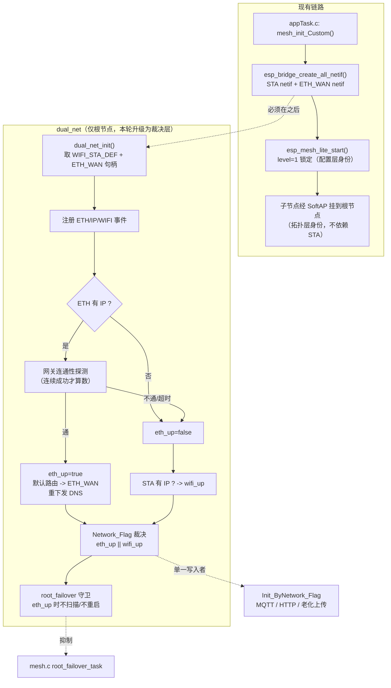

## 产品概述

在已完成 L0（dual_net 仅根节点初始化、只观察不改路由）的基础上，正式接入 **KSZ8851SNL 有线以太网**，使其作为根节点的真实上行，并经 IoT-Bridge NAPT 供子节点转发上网。核心目标是解决用户提出的场景：**系统经 WiFi 正常启动后接入网线，随后所有 WiFi 连接断开，系统能否仍保持根节点身份**。重点交付：根节点身份维持的判定逻辑、影响因素分析、代码处理与容错设计。

## 场景结论（直接回答用户问题）

**能否保持根节点身份：拓扑层能，功能层目前不能，且现在会被重启打断。**

| 层次 | 判定依据 | WiFi 全断 + 网线可用时 | 是否需要改造 |
|---|---|---|---|
| 配置层 | `IsRoot` 静态配置（`appTask.c:992`） | 保持不变 | 否 |
| 拓扑层 | `esp_mesh_lite_set_allowed_level(1)`（`mesh.c:441`）+ SoftAP 独立于 STA | **保持 level 1**，子节点仍挂在根下 | 否 |
| 抢根风险 | 子节点 `set_disallowed_level(1)`（`mesh.c:443`），不允许成为 level 1 | 天然被抑制，无人可抢根（需实机验证） | 否 |
| 功能层 | NAPT 出口是否有效 | **失效**（external 固定为 STA） | **是** |
| 稳定性 | `root_failover_task` 是否触发重启 | **会被 `esp_restart()`**（最致命） | **是** |

即：`level` 和 SoftAP 不会丢，但「能带孩子上网的根」会丢，且系统会在断 WiFi 约 30 秒后重启，导致业务中断。

## 核心特性

1. **以太网硬件走 IoT-Bridge 官方路径**：删除 dual_net 自带的 KSZ8851SNL 初始化（避免与 `bridge_eth.c:323` 的 `ESP_ERROR_CHECK(spi_bus_initialize(...))` 重复占用 SPI2_HOST 而 abort），改用 `esp_bridge_create_eth_netif()` 生成的 `ETH_WAN` netif（`route_prio=50`）。
2. **以太网承担 NAPT 出口**：子节点流量经根节点以太网出网；ETH 可用时默认路由指向 `ETH_WAN`，并修复 DNS 下发。
3. **根节点身份保活**：`Network_Flag` 语义从「STA 有 IP」升级为「以太网或 STA 任一可用」，使 `root_failover_task` 在以太网可用时不扫描、不重启。
4. **连通性探测与防抖**：杜绝「有 IP 但网关不通」的假连通导致不回落 WiFi；抑制网线热插拔抖动。
5. **完整容错**：硬件缺失、DHCP 失败、MAC 冲突、回落恢复、身份自检与日志留痕。

## 关键约束（已确认）

- 驱动归属：改用 iot_bridge 的 `bridge_eth.c`（用户选择 A）。
- 引脚全部为 Kconfig 项，**可沿用原接线**：SCLK=6、MOSI=15、MISO=7、CS0=16、INT0=4（INT 与 bridge 默认值 4 已一致）。
- 转发范围：以太网需作为 NAPT 出口，子节点也要能上网。
- 故障场景：根节点 STA 断、子节点仍连着根。


## 技术栈

沿用现有工程栈，不引入新依赖：ESP32-S3 / ESP-IDF v5.4.4（独立副本 `/home/wbb/espidf/esp-idf-mesh-lite`）、`espressif/mesh_lite 1.0.2`、`espressif/iot_bridge 1.0.1`、`esp_eth` + KSZ8851SNL（SPI）、`esp_netif` / lwIP NAPT、FreeRTOS 双核。

构建：`IDF_SKIP_CHECK_SUBMODULES=1 idf.py -B build/mesh-lite -D SDKCONFIG=build/mesh-lite/sdkconfig build`

## 一、根节点身份维持的判断逻辑

Mesh-Lite 的「根」不是一个可被以太网维持的运行时状态，而是三层叠加：

1. **配置层（静态）**：`IsRoot` 来自 `baseconfig.json`，`appTask.c:992` 启动期一次性赋值；`mesh.c:440-444` 据此调用 `esp_mesh_lite_set_allowed_level(1)`（根）或 `set_disallowed_level(1)`（子节点）。**这一层与上行介质完全无关**，改以太网不会动摇它。
2. **拓扑层（半静态）**：`esp_mesh_lite_get_level() == ROOT(1)`。根节点的 SoftAP 是子节点的父，SoftAP 不依赖 STA，因此 STA 断开不会让子节点脱网。iot_bridge `User_Guide_CN.md:102` 写明「根节点的上行连接只能是路由器」——即 Mesh-Lite 内部**只以 WiFi STA 是否连上路由器来判断上行**，它看不见以太网。
3. **功能层（本方案要解决的）**：能否带孩子上网、能否不被 failover 重启。这才是以太网要补齐的部分。

**结论**：拓扑身份靠配置锁死，天然稳定；要让「功能性根身份」不丢，必须让上层判定逻辑认识以太网，而不是试图让 Mesh-Lite 认识它。

## 二、影响因素（为什么现在会失败）

| # | 因素 | 位置 | 后果 |
|---|---|---|---|
| 1 | `root_failover_task` 触发重启 | `mesh.c:213-245` | STA 断 30s（`FAILOVER_LOST_IP_MS`）后扫描备用 SSID，扫到即 `esp_restart()`。**插着网线也会重启** |
| 2 | `Network_Flag` 只认 STA | `mesh.c:123/136` | 以太网在线仍被判为 0，触发因素 1，并影响 `appTask.c:4976` 上报门控 |
| 3 | NAPT 出口固定为 STA | `CONFIG_BRIDGE_EXTERNAL_NETIF_STATION=y`；NAPT 在 `bridge_wifi.c:246` 基于 SoftAP IP 开启 | 子节点流量走 STA 出口，以太网不参与转发 |
| 4 | DNS 下发被 STA 覆盖 | `bridge_wifi.c:232-240` 按固定 `#if` 顺序赋值，`WIFI_STA_DEF` 在 `ETH_WAN` 之后覆盖之 | 出口已是以太网，子节点拿到的 DNS 仍来自 STA |
| 5 | 假连通 | 以太网有 IP 但网关不通 | 误判上行可用 → 不回落 WiFi → 业务全卡死 |
| 6 | 网线热插拔抖动 / DHCP 慢 | `ETHERNET_EVENT_CONNECTED/DISCONNECTED` | 频繁切路由、日志刷屏 |
| 7 | 固定 MAC 冲突 | `bridge_eth.c:344` 写死 `02:00:00:12:34:56` | 多台设备同 MAC，局域网冲突 |
| 8 | 硬件缺失 | `bridge_eth.c:333-337` 逐个探测芯片 | `eth_handle_spi` 为 NULL 时走不到初始化（不 abort），但需确认日志可诊断 |
| 9 | 双根风险 | 子节点 `disallowed_level(1)` | 天然抑制，需实机验证 |

## 三、实现方案

### 总体策略

**不试图让 Mesh-Lite 认识以太网**（闭源库，做不到），而是在其之上加一层「上行裁决」：dual_net 综合以太网与 STA 的**真实连通性**得出「本机是否有可用上行」，并据此 (a) 决定默认路由，(b) 决定 `Network_Flag`，(c) 抑制不该发生的 failover 重启。

### 关键技术决策

- **决策 1：删除 dual_net 自带的 KSZ8851SNL 硬件初始化，全面改用 iot_bridge。**
  二者都用 SPI2_HOST；`bridge_eth.c:323` 是 `ESP_ERROR_CHECK(spi_bus_initialize(...))`，重复初始化返回 `ESP_ERR_INVALID_STATE` 会直接 abort。同时 iot_bridge 原生支持 KSZ8851SNL（`bridge_eth.c:192-222`，`CONFIG_ETH_SPI_ETHERNET_KSZ8851SNL=y` 已开），且 `ETH_WAN` 带 `route_prio=50`、已接入 `esp_bridge_netif_list_add()`，是唯一能正确参与 NAPT/DHCP 的路径。

- **决策 2：ETH 与 STA 作为两个 external netif 并存，靠 `route_prio` + 显式默认路由决定出口。**
  `esp_bridge_create_all_netif()` 中二者是独立 `#if` 块（`bridge_common.c:643-660`），可同时开启。ETH_WAN 的 `route_prio=50` 高于 STA，但 lwIP 的默认路由切换仍需在 `IP_EVENT_ETH_GOT_IP` 后显式 `esp_netif_set_default_netif(eth_netif)`，避免 STA 抢先成为默认出口。

- **决策 3：`Network_Flag` 改由 dual_net 裁决，mesh.c 停止直接写入。**
  这是消除「因素 1 + 因素 2」的唯一办法。为避免双写，`mesh.c:123/136` 两处写点必须同步移除或改为调用统一裁决入口。dual_net 已是唯一同时感知 ETH 与 STA 的模块，且只在根节点运行——语义上正好是「根节点上行裁决者」。

- **决策 4：连通性用「有 IP + 网关可达」双重判定，而非只看 IP。**
  `IP_EVENT_ETH_GOT_IP` 只说明 DHCP 成功。必须在拿到 IP 后向网关发起探测（ICMP echo 或 ARP 解析），连续成功才置 `eth_up=true`。否则「拿到 IP 但网线接的是个不通的设备」会锁死在上行不可用却不回落的僵局。

- **决策 5：不修改 managed_components。**
  `managed_components/` 由 `idf.py` 从组件仓库解包，直接改会在重新构建时被覆盖。因素 4（DNS 覆盖）的修复放在应用层：ETH 成为出口后由 dual_net 调用公开的 `esp_bridge_update_dns_info(eth_netif, softap_netif)`（`esp_bridge.h:162`）重新下发。

- **决策 6：MAC 冲突在应用层规避。**
  `bridge_eth.c:344` 写死 `02:00:00:12:34:56`。在 `esp_bridge_create_eth_netif()` 返回后，用 WiFi STA MAC 派生一个本地单播 MAC（bit0 清零、bit1 置 1、末字节偏移）并通过 `esp_eth_ioctl(ETH_CMD_S_MAC_ADDR)` 覆写——复用 dual_net 原有的 `dual_net_set_valid_eth_mac()` 思路，但改为作用于 iot_bridge 的 netif。

### 性能与可靠性

- 连通性探测放在已有的 `net_monitor` 任务（CPU1，`LG_PRIO_NET_MONITOR=3`）中，周期 60s；仅 ETH 已取得 IP 时探测，避免空跑。探测用非阻塞超时，不在事件上下文中执行。
- `IP_EVENT`/`WIFI_EVENT`/`ETH_EVENT` 处理器内只做状态赋值与轻量日志，不阻塞、不做 I/O、不调 MQTT/HTTP。
- 日志沿用 `ESP_LOGI/W`，中文；状态快照 60s 一次；错误统一 `storage_write_record_cyclic()`；禁止打印密码等敏感字段。

## 四、执行要点（防回归）

- **SPI 总线唯一持有者**：删除 `dual_net.c` 的 `dual_net_eth_init()`、`dual_net_set_valid_eth_mac()` 与 `spi_bus_initialize`，以及 `dual_net.h` 的 `SPI_MOSIPIN/MISOPIN/SCLKPIN/CSPIN/ETH_INT`、`LG_DUAL_NET_ETH_SPI_CLK_HZ/QUEUE_SIZE`。改由 `DUAL_NET_ETH_HW_ENABLE` 语义变为「接管 ETH_WAN netif」。
- **netif 获取时机**：`esp_netif_get_handle_from_ifkey("ETH_WAN")` 必须在 `esp_bridge_create_all_netif()`（`mesh.c:378`）之后，即仍在 `appTask.c` 中 `mesh_err == ESP_OK` 分支内、`IsRoot == 1` 之后调用 `dual_net_init()`。
- **sdkconfig 双写**：`sdkconfig.defaults` 只对生成新配置生效；实际生效的是 `build/mesh-lite/sdkconfig`。**两处都要改**（`MESH_LITE_MIGRATION.md` 已记录此坑）。
- **mesh.c 只做增量**：`root_failover_task` 加 `if (!dual_net_is_ethernet_active())` 守卫；`Network_Flag` 两处写点改为调用裁决入口。不改变现有分支主干逻辑。
- **保留 L0 可回退**：所有新增副作用仍受 `DUAL_NET_ENABLE_ROUTE_CONTROL` 门控，一旦以太网异常可关闭宏回到纯观察模式。
- **零改动红线**：`Init_ByNetwork_Flag()` 主干、`esp_mesh_lite_*` 初始化序列、`app_task_init()` 现有分支不动。

## 五、架构设计



**层次关系**：dual_net 从 L0 的「观察层」升级为 L1 的「上行裁决层」；Mesh-Lite 仍只负责拓扑，且始终只见 WiFi。两者职责不重叠。

## 六、目录结构

```
ESP32Aging/
├── sdkconfig.defaults                                # [MODIFY] 新增 CONFIG_BRIDGE_EXTERNAL_NETIF_ETHERNET=y
│                                                     #          及引脚覆盖：SCLK=6/MOSI=15/MISO=7/CS0=16/INT0=4
├── build/mesh-lite/sdkconfig                          # [MODIFY] 同步上述两项（实际生效配置）
├── main/
│   ├── Communication/Internet/dual_net/
│   │   ├── dual_net.h                                # [MODIFY] 删除 SPI_*PIN 与 LG_DUAL_NET_ETH_SPI_*；
│   │   │                                             #          DUAL_NET_ETH_HW_ENABLE 语义改为「接管 ETH_WAN」并默认 1；
│   │   │                                             #          新增连通性判定与防抖参数宏、dual_net_is_uplink_ready() 等 API
│   │   └── dual_net.c                                # [MODIFY] 删除 dual_net_eth_init()/set_valid_eth_mac()/spi_bus_initialize；
│   │   │                                             #          改为 esp_netif_get_handle_from_ifkey("ETH_WAN") 接管；
│   │   │                                             #          新增网关连通性探测、link 防抖、MAC 派生覆写、DNS 重下发；
│   │   │                                             #          Network_Flag 裁决；路由切换
│   ├── Communication/Internet/Mesh/
│   │   └── mesh.c                                    # [MODIFY] 仅增量：root_failover_task 加以太网守卫；
│   │                                                 #          Network_Flag 两处写点改为调用 dual_net 裁决入口（消除双写）
│   └── Task/appTask.c                                # [MODIFY] 极小：保持既有 dual_net_init() 调用点不变
├── DUAL_NET_DESIGN.md                                # [MODIFY] 新增 L1 章节：根节点身份三层判定、影响因素表、
│                                                     #          以太网接入改造清单、容错矩阵、实机验收步骤
└── MESH_LITE_MIGRATION.md                            # [MODIFY] 更新「以太网上行状态」为已启用说明
```

## 七、关键代码结构

`dual_net.h` 新增契约（多文件依赖，需精确定义）：

```c
/* 以太网接管后，判定「上行可用」必须同时满足：有 IP + 网关可达 */
#ifndef DUAL_NET_ETH_LINK_UP_DEBOUNCE_MS
#define DUAL_NET_ETH_LINK_UP_DEBOUNCE_MS    3000   /* 网线插入去抖确认时间 */
#endif
#ifndef DUAL_NET_ETH_LINK_DOWN_DEBOUNCE_MS
#define DUAL_NET_ETH_LINK_DOWN_DEBOUNCE_MS  1000   /* 网线拔出确认时间 */
#endif
#ifndef DUAL_NET_ETH_PROBE_TIMEOUT_MS
#define DUAL_NET_ETH_PROBE_TIMEOUT_MS       2000   /* 单次网关探测超时 */
#endif
#ifndef DUAL_NET_ETH_PROBE_SUCCESS_COUNT
#define DUAL_NET_ETH_PROBE_SUCCESS_COUNT    2      /* 连续成功次数才认定可用 */
#endif
#ifndef DUAL_NET_ETH_PROBE_FAIL_COUNT
#define DUAL_NET_ETH_PROBE_FAIL_COUNT       3      /* 连续失败次数才认定不可用 */
#endif

/* 上行可用性：Mesh-Lite 只看 WiFi，以太网必须由本模块补充判定 */
typedef enum {
    DUAL_NET_UPLINK_STATE_NONE = 0,  /* 无可用上行 */
    DUAL_NET_UPLINK_STATE_PROBING,   /* 已取得 IP，正在探测网关 */
    DUAL_NET_UPLINK_STATE_READY,     /* IP + 网关均可达 */
    DUAL_NET_UPLINK_STATE_STALE,     /* 曾可用，现探测失败（等待回落） */
} dual_net_uplink_state_t;

dual_net_uplink_state_t dual_net_get_uplink_state(void);
bool                    dual_net_is_uplink_ready(void);   /* 供 root_failover 与 Network_Flag 裁决 */
esp_err_t               dual_net_refresh_dns_to_softap(void); /* 修复 STA 覆盖 DNS 的问题 */
```

`mesh.c` 的增量守卫（示意，保持现有分支结构）：

```c
/* root_failover_task 内：以太网可用时不进入扫描/重启分支 */
if (dual_net_is_uplink_ready()) {
    lost_since = 0;
    s_scan_requested = false;
    continue; /* 上行由以太网承担，无需切换路由器 */
}
```

## 八、容错设计矩阵

| 异常 | 检测 | 处置 |
|---|---|---|
| 以太网硬件缺失/未焊接 | `esp_netif_get_handle_from_ifkey("ETH_WAN")` 返回 NULL | 降级为纯 WiFi，记录日志，不 abort |
| SPI 总线冲突 | 已消除（dual_net 不再 `spi_bus_initialize`） | — |
| 网线反复插拔 | link up/down 去抖计时 | 抖动期间不改变路由与 `Network_Flag` |
| DHCP 失败/慢 | `IP_EVENT_ETH_GOT_IP` 超时未到 | 保持 WiFi 上行，周期重试 |
| 有 IP 但网关不通 | 网关连通性探测连续失败 | 置 `STALE`，回落 WiFi，恢复 root_failover |
| 以太网中途断开 | 探测失败 + `IP_EVENT_ETH_LOST_IP` | 默认路由切回 STA，DNS 重下发，failover 恢复工作 |
| 多机 MAC 冲突 | 启动时派生 MAC 覆写 | 以 WiFi STA MAC 派生的本地单播地址 |
| 根节点身份丢失 | 周期 `esp_mesh_lite_get_level()` 自检 | 记录日志 + 循环存储，必要时恢复告警 |
| 双根 | 子节点 `disallowed_level(1)` 天然抑制 | 实机验证 |


## Agent Extensions

### Skill
- **embedded-coding-standard**
  - Purpose：改造 `dual_net.c/h` 与 `mesh.c` 前，读取工程本地规范 `.ai/coding-standard.md`（中文注释、宏参数加括号、禁止魔法数、单位写入变量名、函数返回值必须处理、公开函数说明调用上下文），据此约束新增的探测任务、事件处理器与容错分支。
  - Expected outcome：新增代码符合项目本地嵌入式 C 规范，命名与相邻模块一致，无未处理的返回值与裸魔法数。

### SubAgent
- **code-explorer**
  - Purpose：核实三件事——(1) `esp_bridge_eth_spi_init()` 在 KSZ8851SNL 缺失时的完整失败路径，确认不会 abort；(2) `esp_bridge_update_dns_info()` 的签名、前置条件与调用约束；(3) `esp_mesh_lite_get_level()` 在根节点 STA 断开后的实际取值来源，确认 level 是否被闭源库改写。
  - Expected outcome：产出「失败路径安全确认 + DNS 修复可行性 + level 稳定性」结论，直接用于实现，避免启用以太网后整机 abort 或误判身份。
